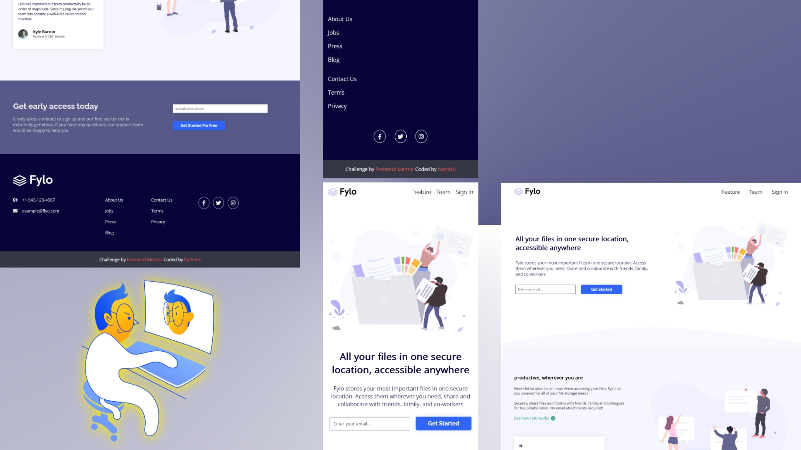

# Frontend Mentor - Fylo landing page with two column layout solution

This is a solution to the [Fylo landing page with two column layout challenge on Frontend Mentor](https://www.frontendmentor.io/challenges/fylo-landing-page-with-two-column-layout-5ca5ef041e82137ec91a50f5). Frontend Mentor challenges help you improve your coding skills by building realistic projects. 

## Table of contents

- [Overview](#overview)
  - [The challenge](#the-challenge)
  - [Screenshot](#screenshot)
  - [Links](#links)
  - [Built with](#built-with)
  - [What I learned](#what-i-learned)
  - [Continued development](#continued-development)
  - [Useful resources](#useful-resources)
- [Author](#author)

## Overview

### The challenge

Users should be able to:

- View the optimal layout for the site depending on their device's screen size
- See hover states for all interactive elements on the page

### Screenshot

### Links

- Solution URL: [solution](https://github.com/HatimHJ/fylo-landing-page)
- Live Site URL: [live site](https://hatimhj.github.io/fylo-landing-page/)

### Built with

- Semantic HTML5 markup
- CSS custom properties
- Flexbox
- CSS Grid
- SCSS
- Mobile-first workflow

### What I learned

- layout with grid and flexbox

### Continued development

- layout with grid and flexbox

### Useful resources

- [W3schools](https://www.w3schools.com/) - the place to go for quick frontend reference and more

- [cssloaders](https://cssloaders.github.io/) - great css only loader

- [bennettfeely](https://bennettfeely.com/clippy/) 

## Author

- Website         - [@HatimHJ](https://github.com/HatimHJ)
- Frontend Mentor - [@HatimHJ](https://www.frontendmentor.io/profile/HatimHJ)
